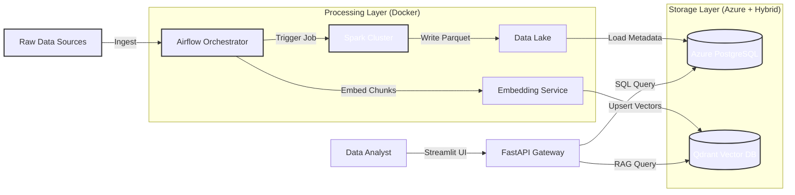
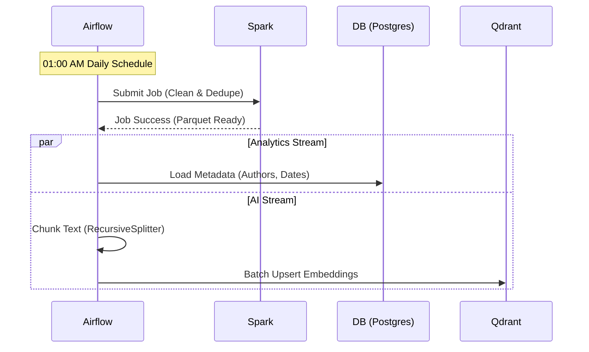

# Pipeline-X: Applied AI Data Platform

> 🚀 **A Hybrid Cloud, Big Data-Ready ELT & RAG Pipeline connecting Raw Data with GenAI Orchestration.**

[](https://youtu.be/1yQl7gMAKNU)

> 📺 **[Watch the Platform Demo](https://youtu.be/1yQl7gMAKNU)** featuring Apache Spark distributed processing, Airflow orchestration, and Azure Hybrid Cloud deployment.


**Pipeline-X** is a reference architecture for building "Data Foundations for AI". It demonstrates the complete lifecycle of a modern data platform: orchestrating distributed data processing (Spark), managing hybrid cloud infrastructure (Terraform/Azure), and generating vector embeddings for AI Retrieval Augmented Generation (RAG).

---

## 1. Executive Summary & Business Value

Most AI projects fail because the underlying data infrastructure is brittle. Pipeline-X addresses the "Data Foundation" gap.

| KPI | The Problem | Pipeline-X Solution |
| :--- | :--- | :--- |
| **Data Gravity** | Training data is stuck in silos (CSVs, SQL, APIs). | **Unified ELT:** Airflow orchestrates the ingestion from all sources into a central Data Lake. |
| **Scalability** | Pandas scripts crash on datasets >10GB. | **Distributed Compute:** Automatically hands off heavy transformations to an **Apache Spark Cluster** (Master/Worker architecture). |
| **Search Quality** | Standard keyword search misses context. | **Semantic Search:** A parallel pipeline chunks and embeds text into **Qdrant**, enabling "Meaning-based" retrieval for RAG apps. |

---

## 2. System Architecture (C4 Model)

We utilize a Hybrid Cloud architecture: Sensitive compute runs in containers (or on-prem), while durable storage lives in managed Azure Cloud services.

### Level 1: System Context
The Data Lifecycle: Ingest $\rightarrow$ Process $\rightarrow$ Serve.



### Level 2: The "Dual-Stream" Pipeline
How we keep Analytics (SQL) and AI (Vectors) in sync.



---

## 3. Architecture Decision Records (ADR)

Strategic infrastructure choices for a scalable data platform.

| Component | Decision | Alternatives Considered | Justification (The "Why") |
| :--- | :--- | :--- | :--- |
| **Compute Engine** | **Apache Spark** | Pandas / Dask | **Horizontal Scale:** Pandas is memory-bound to a single machine. Spark allows us to add worker nodes seamlessly as data grows from GBs to TBs without rewriting code. |
| **Orchestration** | **Airflow** | Cron / Prefect | **Dependency Management:** We need complex DAGs (Directed Acyclic Graphs) where the Vector Store update *must not start* unless the Data Quality checks pass. Airflow handles these retry logics natively. |
| **Infrastructure** | **Terraform** | Azure Portal (ClickOps) | **Reproducibility:** The entire database layer (Postgres Flexible Server) is defined as code. This allows us to spin up identical "Staging" and "Prod" environments in minutes. |

---

## 4. Cost & Scale Modeling (FinOps)

**Scenario:** Ingesting 100GB of daily logs + 1M Vector Embeddings.

| Resource | Unit Cost | Monthly Est. | Optimization Strategy |
| :--- | :--- | :--- | :--- |
| **Azure PostgreSQL** | B1ms Instance | ~$15.00 | Used "Burstable" tier for metadata storage since read load is low (mostly writes during ETL). |
| **Compute (Spark)** | On-Prem / VM | $0.00* | Spark runs on existing Docker infrastructure. If moved to Databricks, costs would rise significantly. |
| **Vector Storage** | Qdrant (Disk) | ~$5.00 | **Quantization:** Enabled binary quantization in Qdrant to reduce RAM usage by 4x with minimal accuracy loss. |

---

## 5. Reliability & Governance Strategy

### Data Quality (Great Expectations)
* **Schema Validation:** The Spark job enforces strict schema on ingestion. If a column is missing in the source CSV, the pipeline halts *before* polluting the data lake.
* **Idempotency:** Airflow DAGs are designed to be re-runnable. If the job fails halfway, re-running it will **overwrite** the specific partition rather than duplicating data.

### Hybrid Connectivity
* **Terraform Output Injection:** The infrastructure deployment (`infra/main.tf`) automatically outputs the Database Connection String. This is injected into the Docker containers via environment variables, ensuring no hardcoded credentials exist in the repo.

---

### Why this exists
Building reliable data pipelines for AI is complex. Pipeline-X solves common engineering pitfalls by demonstrating a robust, unified architecture that scales from "Local Dev" to "Enterprise Cloud":

1.  **Hybrid Cloud Architecture:** Deploys storage resources to **Microsoft Azure** using **Terraform (IaC)**, connecting local microservices to managed cloud databases.
2.  **Big Data Ready:** Features a dual-mode transformation layer. It uses **Pandas** for speed on small data and includes an integrated **Apache Spark Cluster** for distributed processing of massive datasets.
3.  **Dual-Stream Processing:** Orchestrates a workflow that splits data into structured metadata (for SQL Warehousing) and unstructured chunks (for Vector Search), keeping Analytics and AI in sync.
4.  **Decoupled Service Layer:** Exposes data via a **FastAPI** microservice, allowing frontend applications (Streamlit) to consume RAG capabilities without direct database access.

---

## System Architecture

The application is built on a containerized microservices architecture managed by Docker Compose, connected to Azure Cloud:

1.  **Orchestrator (Apache Airflow):** The "Manager." It schedules DAGs, monitors dependencies, and triggers Spark jobs.
2.  **Compute Engine:**
    * **Local Executor:** Runs lightweight Python/Pandas tasks.
    * **Apache Spark Cluster:** A Master/Worker setup for distributed ETL and Parquet file generation.
3.  **Storage Layer (Hybrid):**
    * **Azure Database for PostgreSQL:** Managed Cloud Database storing structured metadata (Author, Date, Category).
    * **Qdrant (Local):** Stores high-dimensional vector embeddings for semantic search.
4.  **Service Layer (FastAPI):** A lightweight REST API that handles embedding generation and vector similarity search.
5.  **User Interface (Streamlit):** An interactive "Corporate Search" dashboard for natural language querying.

---

## Tech Stack

### Infrastructure & Cloud
-   **Cloud Provider:** Microsoft Azure (Sweden Central Region)
-   **IaC:** Terraform
-   **Database:** Azure Database for PostgreSQL (Flexible Server)

### Orchestration & Big Data
-   **Manager:** Apache Airflow 2.9
-   **Distributed Compute:** Apache Spark 3.5.1 (PySpark)
-   **Local Transform:** Pandas 2.2

### AI & Storage
-   **Vector DB:** Qdrant
-   **AI Framework:** LangChain (Chunking), Sentence-Transformers (Embeddings)

### Interface & API
-   **Backend:** FastAPI, Uvicorn
-   **Frontend:** Streamlit

---

## Getting Started

### Prerequisites

-   Docker Desktop installed
-   Make (Optional, but recommended)
-   **Optional:** Azure CLI & Terraform (Only required if deploying infrastructure)

### Installation

1.  **Clone the repository**
    ```bash
    git clone https://github.com/Nibir1/Pipeline-X.git
    cd Pipeline-X
    ```

2.  **Infrastructure Setup (Optional - Hybrid Mode)**
    If you want to use Azure Cloud Storage, use the provided Terraform scripts:
    ```bash
    cd infra
    terraform init
    terraform apply
    # Copy the 'db_host' output to your .env file
    ```

3.  **Set Environment Variables**
    Create a `.env` file in the root directory. Update `POSTGRES_HOST` if using Azure, or keep it `postgres` for local testing.
    ```bash
    AIRFLOW_UID=50000
    POSTGRES_HOST=pipeline-x-db-xxxx.postgres.database.azure.com  # Or 'postgres' for local
    POSTGRES_USER=airflow_admin
    POSTGRES_PASSWORD=SecurePassword123!
    POSTGRES_DB=airflow
    QDRANT_HOST=qdrant
    API_URL=http://localhost:8000/docs
    ```

4.  **Build and Run**
    ```bash
    make build
    ```

The `make` command handles the sequential build process. Once complete:
-   **Frontend UI:** [http://localhost:8501](http://localhost:8501)
-   **Airflow UI:** [http://localhost:8080](http://localhost:8080)
-   **Spark Master UI:** [http://localhost:8081](http://localhost:8081)

### Testing & Validation

The project includes specific verification scripts for AI and Big Data.

**1. Verify Semantic Search (RAG)**
```bash
make shell
python scripts/test_retrieval.py
```

**2. Verify Spark Cluster (Big Data) Run the PySpark transformer to process raw data into Parquet format:**
```bash
make shell
# Generate mock data first
python gen_data.py
# Submit job to Spark Cluster
python src/etl/spark_transformer.py
```

## Project Structure

```text
pipeline-x/
├── docker-compose.yml        # Orchestration (Airflow, Spark, API, UI)
├── Makefile                  # Build automation scripts
├── infra/                    # Terraform Infrastructure as Code (Azure)
│   ├── main.tf               # Cloud Resource Definitions
│   └── .gitignore            # Excludes Terraform state/binaries
├── dags/                     # Airflow DAGs
│   ├── ingestion_pipeline.py # Main ELT + AI workflow
│   └── utils/                # DB Connectors
├── src/                      # Core Logic
│   ├── etl/                  # Extractors & Transformers
│   │   ├── extractor.py      # Data Generator
│   │   └── spark_transformer.py # PySpark Logic
│   ├── ai/                   # Chunking & Embedding logic
│   ├── api/                  # FastAPI Backend
│   └── ui/                   # Streamlit Frontend
├── requirements.txt          # Python Dependencies
└── Dockerfile                # Custom Airflow Image (includes OpenJDK)
```

## Roadmap
- [x] Core Pipeline: End-to-End ELT with Airflow
- [x] RAG Integration: Vector Search with Qdrant & LangChain
- [x] Hybrid Cloud: Azure Database deployment via Terraform
- [x] Big Data Engine: Apache Spark Integration
- [ ] Kubernetes: Helm Chart deployment

---

## Developer Spotlight
Architected by **Nahasat Nibir** - *Senior Data Engineer & AI Platform Architect*
