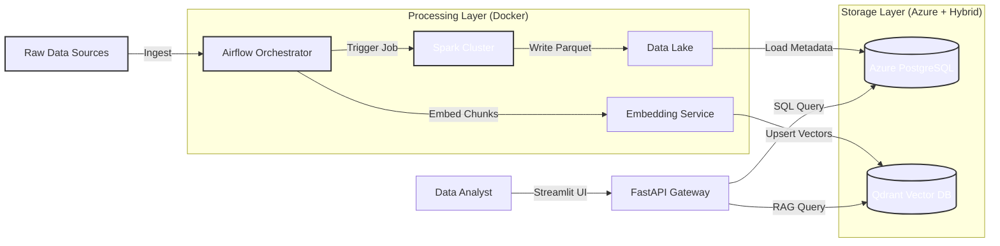
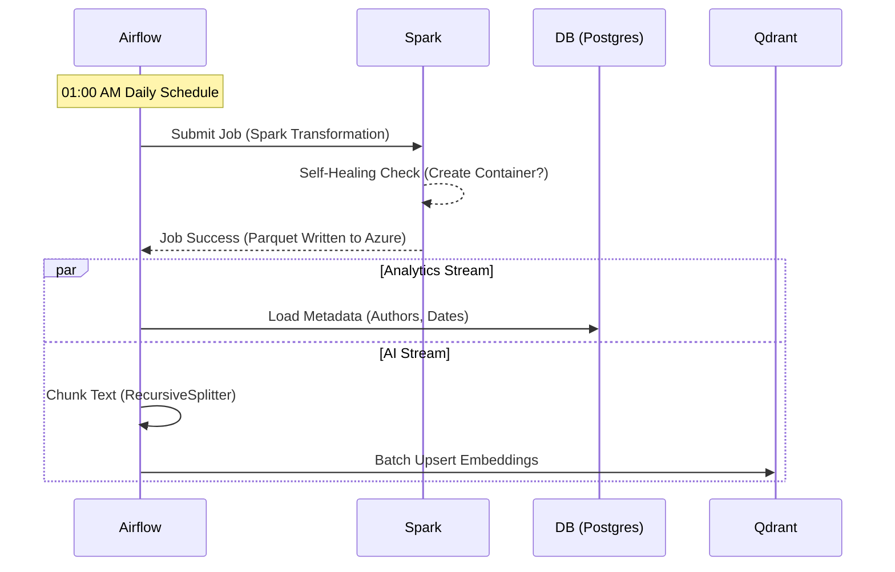

# Pipeline-X: Enterprise Hybrid Cloud Data Platform

> **A Production-Grade Hybrid Lakehouse connecting Big Data ETL with Generative AI.**

[](https://youtu.be/1yQl7gMAKNU)

> 📺 **[Watch the Platform Demo](https://youtu.be/1yQl7gMAKNU)** featuring Apache Spark distributed processing, Airflow orchestration, and Azure Hybrid Cloud deployment.


**Pipeline-X** is a reference architecture for a **Modern Data Platform**. It demonstrates how to bridge the gap between traditional Data Engineering (ETL) and AI Engineering (RAG) using a **Hybrid Cloud** approach. It runs compute locally (Docker) while offloading durable storage to the cloud (Azure), ensuring scalability, cost-efficiency, and data resilience.

---

## 1. Why This Exists (The Problem & Solution)

Building reliable data pipelines for AI is complex. Most projects fail because the underlying data foundation is brittle. Pipeline-X solves common engineering pitfalls by demonstrating a robust, unified architecture that scales from "Local Dev" to "Enterprise Cloud":

| The Problem | Pipeline-X Solution |
| :--- | :--- |
| **Data Gravity** | Training data is stuck in silos (CSVs, SQL). | **Unified ELT:** Airflow orchestrates ingestion into a central Data Lake. |
| **Scalability** | Pandas scripts crash on datasets >10GB. | **Distributed Compute:** Automatically hands off heavy transformations to an **Apache Spark Cluster**. |
| **Contextual AI** | Standard search misses meaning. | **Dual-Stream Processing:** Splits data into structured metadata (SQL) and unstructured chunks (Vector Search) to keep Analytics and AI in sync. |
| **Security** | Hardcoded credentials in code. | **Hybrid Connectivity:** Deploys Azure resources via Terraform and injects secrets directly into Docker containers at runtime. |

---

## 2. Architecture Overview

Pipeline-X implements a **Polyglot Architecture**, utilizing the "Right Tool for the Job" strategy.

### System Context (Hybrid Cloud)
The Data Lifecycle: Ingest $\rightarrow$ Process $\rightarrow$ Serve.



### The "Dual-Stream" Logic

How we orchestrate Analytics (SQL), Big Data (Spark), and AI (Vectors) in parallel.



---

## 3. Architecture Decision Records (ADR)

Strategic infrastructure choices for a scalable data platform.

| Component | Decision | Alternatives Considered | Justification (The "Why") |
| --- | --- | --- | --- |
| **Compute Engine** | **Apache Spark** | Pandas / Dask | **Horizontal Scale:** Pandas is memory-bound to a single machine. Spark allows us to add worker nodes seamlessly as data grows from GBs to TBs without rewriting code. |
| **Orchestration** | **Airflow** | Cron / Prefect | **Dependency Management:** We need complex DAGs where the Vector Store update *must not start* unless the Data Quality checks pass. Airflow handles these retry logics natively. |
| **Infrastructure** | **Terraform** | Azure Portal (ClickOps) | **Reproducibility:** The entire database layer (Postgres Flexible Server) is defined as code. This allows us to spin up identical "Staging" and "Prod" environments in minutes. |
| **Search Engine** | **Qdrant** | PGVector / Pinecone | **Performance:** Qdrant is written in Rust and optimized for high-throughput vector search. We use it locally to avoid vendor lock-in but it scales easily to cloud. |

---

## 4. Key Engineering Features

### A. Hybrid Cloud Spark Engine (The "Big Data" Layer)

Unlike simple Python scripts, Pipeline-X uses a dedicated **Apache Spark Cluster** (Master/Worker topology) running inside Docker to process heavy datasets.

* **Self-Healing Infrastructure:** The Spark job (`spark_transformer.py`) implements **Infrastructure as Code (IaC)** logic. It checks for the existence of the target Azure Data Lake container (`processed-data`) and **automatically provisions it** via the Azure SDK if it's missing.
* **Cloud-Native Storage:** Data is processed locally but written directly to **Azure Data Lake Storage (ADLS) Gen2** in Snappy-compressed Parquet format.

### B. Reliability & Governance Strategy

* **Schema Validation:** The Spark job enforces strict schema on ingestion. If a column is missing in the source CSV, the pipeline halts *before* polluting the data lake.
* **Idempotency:** Airflow DAGs are designed to be re-runnable. If the job fails halfway, re-running it will **overwrite** the specific partition rather than duplicating data.
* **Decoupled Service Layer:** Exposes data via a **FastAPI** microservice, allowing frontend applications (Streamlit) to consume RAG capabilities without direct database access.

---

## 5. Tech Stack

| Layer | Technology | Role |
| --- | --- | --- |
| **Orchestration** | **Apache Airflow 2.9** | DAG Scheduling, Dependency Management, Retries. |
| **Compute** | **Apache Spark 3.5** | Distributed processing of large-scale datasets. |
| **Storage** | **Azure Data Lake Gen2** | Cloud "Landing Zone" for Parquet files. |
| **Database** | **Azure PostgreSQL 15** | Relational storage for structured metadata. |
| **Vector DB** | **Qdrant** | High-performance vector similarity search. |
| **Frontend** | **Streamlit + FastAPI** | Interactive AI Chat Interface. |
| **Infrastructure** | **Terraform** | IaC for Azure Resource Groups, Storage, and Networking. |

---

## 6. Getting Started

### Prerequisites

* **Docker Desktop** (with at least 8GB RAM allocated)
* **Azure Account** (Free Tier works)
* **Terraform CLI** (Optional, for auto-provisioning)

### Step 1: Provision Infrastructure (Hybrid Mode)

We use Terraform to spin up the Azure Data Lake and PostgreSQL database.

```bash
make infra-init
make infra-up

```

* *This will output your Azure connection details. You will need them for the next step.*

### Step 2: Configuration (.env)

Create a `.env` file in the root directory. This configures both Local Docker services and Cloud Connectivity.

```ini
# ==========================================
# 1. System & Airflow Configuration
# ==========================================
AIRFLOW_UID=50000
AIRFLOW_PROJ_DIR=./dags

# ==========================================
# 2. Database Configuration (PostgreSQL)
# ==========================================
# OPTION A: LOCAL DOCKER (Default)
POSTGRES_HOST=postgres
POSTGRES_USER=airflow
POSTGRES_PASSWORD=airflow
POSTGRES_DB=airflow
POSTGRES_PORT=5432

# OPTION B: AZURE HYBRID CLOUD (From Terraform Output)
# POSTGRES_HOST=pipeline-x-db-<id>.postgres.database.azure.com
# POSTGRES_USER=airflow_admin
# POSTGRES_PASSWORD=SecurePassword123!

# ==========================================
# 3. Azure Data Lake (For Spark)
# ==========================================
# Required for 'Self-Healing' Spark jobs to write to Cloud
AZURE_STORAGE_ACCOUNT_NAME=pipelinex<your_id>
AZURE_STORAGE_ACCOUNT_KEY=<your_primary_key>

# ==========================================
# 4. Vector Database & API
# ==========================================
QDRANT_HOST=qdrant
QDRANT_PORT=6333
API_URL=http://api:8000

```

### Step 3: Build & Launch

We use a unified `Makefile` to handle the Docker build process and network setup.

```bash
make build

```

### Step 4: Run the Pipeline

1. Access **Airflow** at `http://localhost:8080` (User: `admin`, Pass: `admin`).
2. Trigger the `pipeline_x_ingestion` DAG.
3. Watch the graph execute the 3 parallel streams (SQL, Spark, AI).

### Step 5: Validate

* **AI Interface:** Go to `http://localhost:8501` and ask: *"What is the financial outlook?"*
* **Spark Cluster:** Check `http://localhost:8081` to see the completed application.
* **Azure Portal:** Verify the `.parquet` files have landed in your Storage Account.

---

## 7. Project Structure

```text
pipeline-x/
├── Makefile                  # Command Center (Build, Deploy, Clean)
├── docker-compose.yml        # Service Definitions (Airflow, Spark, Qdrant)
├── infra/                    # Terraform (Azure Infrastructure)
│   ├── main.tf               # Cloud Resources (Storage, Postgres)
│   └── outputs.tf            # Connection String Outputs
├── dags/                     # Airflow Orchestration
│   ├── ingestion_pipeline.py # Main DAG
│   └── utils/                # DB Connectors
├── src/                      # Application Logic
│   ├── etl/
│   │   ├── spark_transformer.py # Self-Healing Spark Job
│   │   └── transformer.py       # Pandas Logic
│   ├── ai/
│   │   ├── embedder.py          # Vector Generation (Batch + Realtime)
│   │   └── chunker.py           # Text Splitting
│   ├── api/                  # FastAPI Backend
│   └── ui/                   # Streamlit Frontend
└── requirements.txt          # Python Dependencies

```

---

## 8. FinOps & Cost Modeling

**Scenario:** Processing 100GB Daily.

| Resource | Strategy | Est. Cost |
| --- | --- | --- |
| **Compute** | **Hybrid Offloading:** We run Spark *locally* (or on cheap spot instances) and only pay for Cloud Storage. | **$0.00** (Compute) |
| **Storage** | **Azure Blob (Hot):** Parquet compression reduces size by ~70% vs CSV. | **~$2.50/mo** |
| **Database** | **Azure Postgres (Burstable):** B1ms tier is sufficient for metadata. | **~$15.00/mo** |

---

## Developer Spotlight

**Nahasat Nibir**
*Senior Data Engineer & Cloud Architect*

> "Pipeline-X proves that you don't need Databricks to build a Data Lake. With the right architecture, you can build a robust, self-healing, and scalable platform using Open Source tools and smart Cloud integration."

---